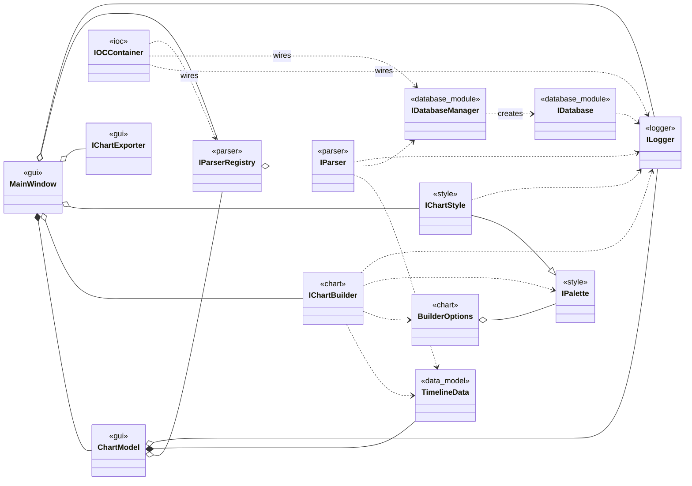
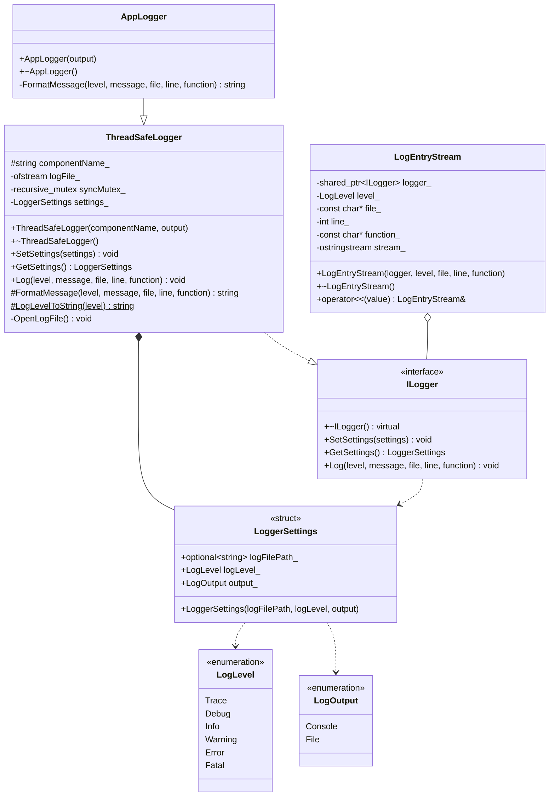
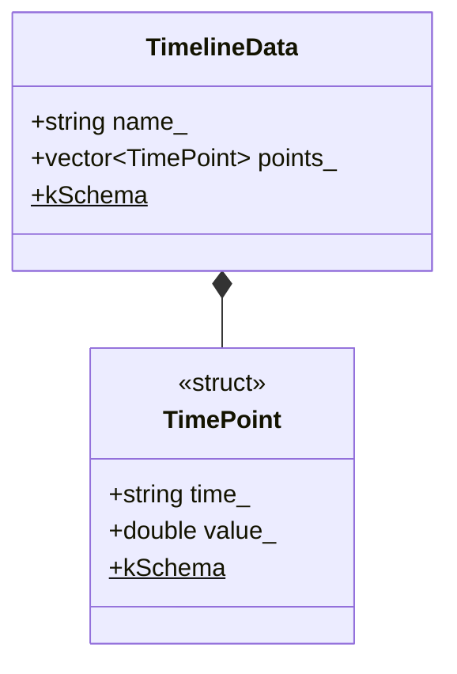
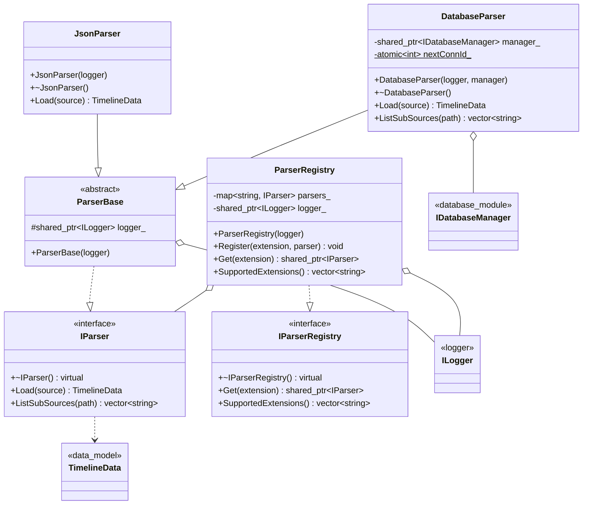
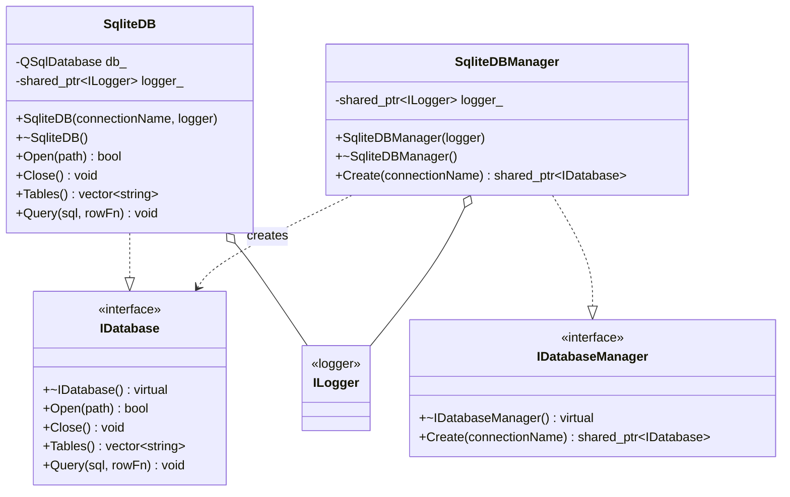
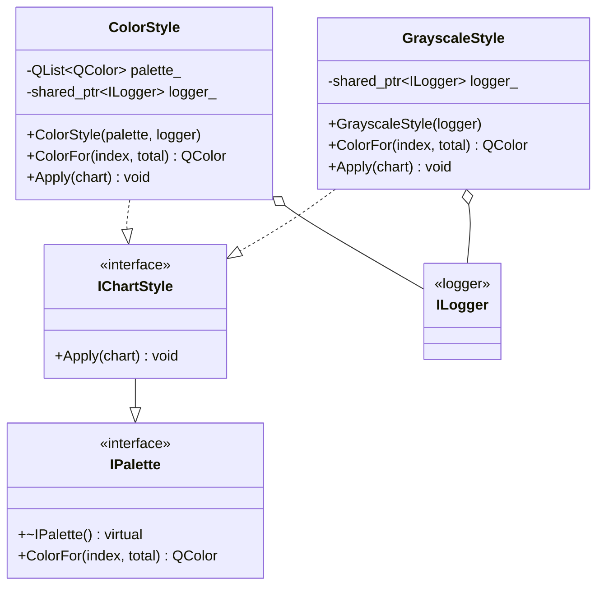
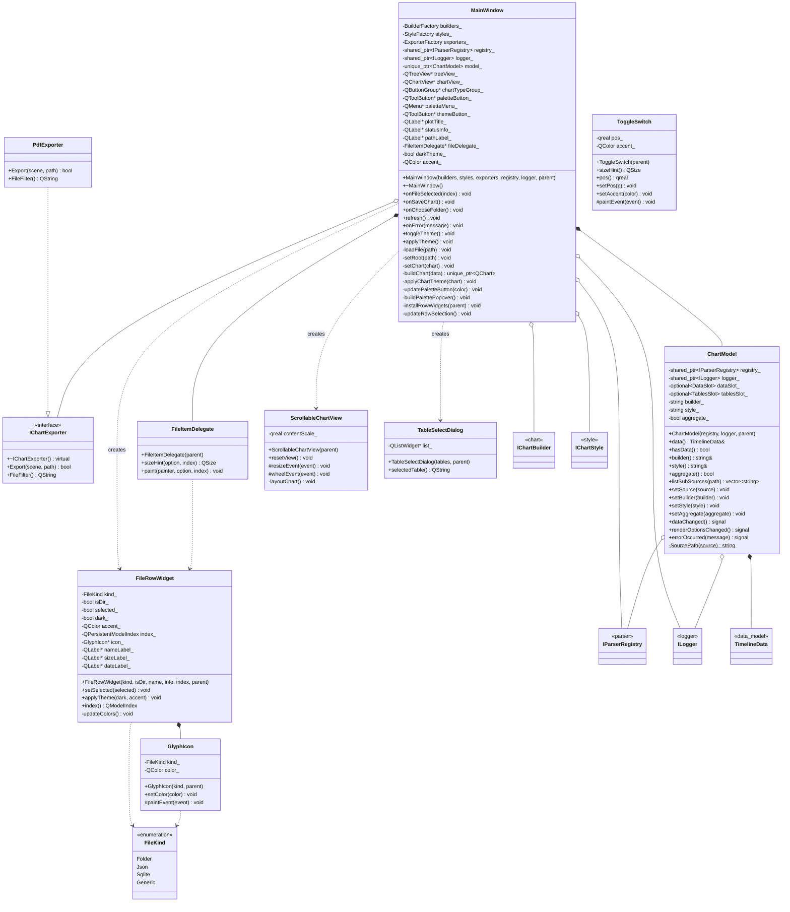

# Лабораторная работа по предмету: "Разработка средств защиты информации"
## Тема: "QtWidgets - Печать графиков"
> 4 курс 2 семестр \
> Студент группы 932223 - **Артеменко Антон Дмитриевич**

## Документация (UML)

Диаграмма классов разбита по модулям — так стрелки не пересекаются и каждый блок
читается отдельно. Исходники — в [`docs/pics`](docs/pics). Внутри модульных диаграмм
коллабораторы из других модулей показаны заглушками со стереотипом-источником
(например, `<<logger>>`) — без членов.

### Обзор (связи между модулями)

Ключевые сущности каждого модуля без членов и связи между ними.
Исходник: [`docs/pics/class_overview.mmd`](docs/pics/class_overview.mmd)

### Модуль logger

Исходник: [`docs/pics/class_logger.mmd`](docs/pics/class_logger.mmd)

### Модуль data_model

Исходник: [`docs/pics/class_data_model.mmd`](docs/pics/class_data_model.mmd)

### Модуль parser

Исходник: [`docs/pics/class_parser.mmd`](docs/pics/class_parser.mmd)

### Модуль database_module

Исходник: [`docs/pics/class_database.mmd`](docs/pics/class_database.mmd)

### Модуль chart

Исходник: [`docs/pics/class_chart.mmd`](docs/pics/class_chart.mmd)

### Модуль style

Исходник: [`docs/pics/class_style.mmd`](docs/pics/class_style.mmd)

### Модуль gui

Исходник: [`docs/pics/class_gui.mmd`](docs/pics/class_gui.mmd)

