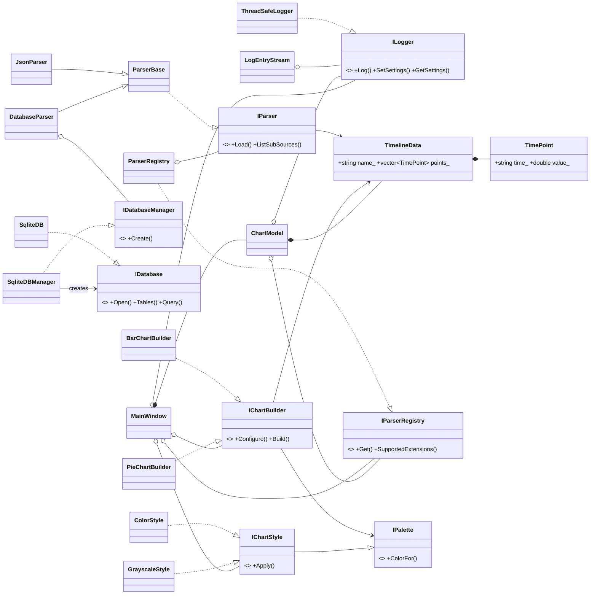
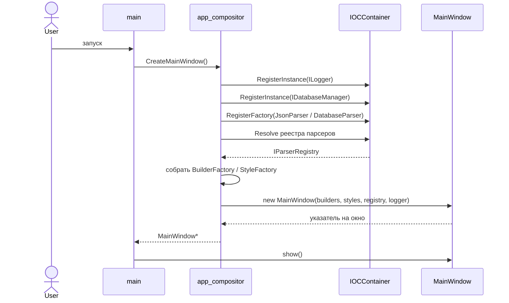
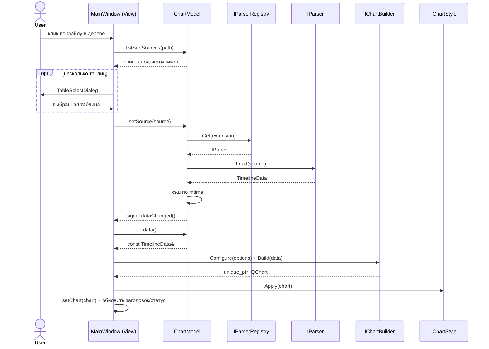
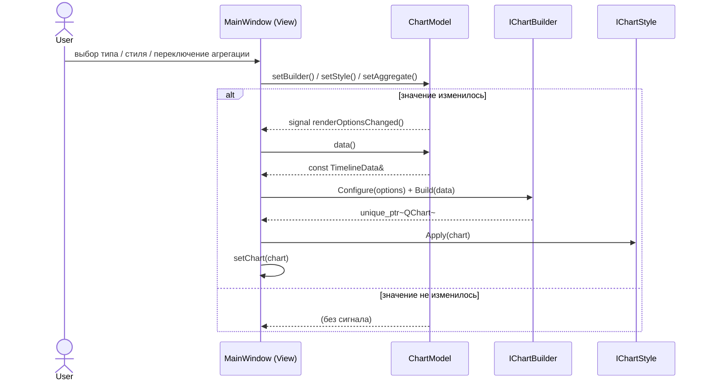

# Лабораторная работа по предмету: "Разработка средств защиты информации"
## Тема: "QtWidgets - Печать графиков"
> 4 курс 2 семестр \
> Студент группы 932223 - **Артеменко Антон Дмитриевич**

## Документация (UML)

Исходники диаграмм — в [`docs/pics`](docs/pics). Ниже они отображаются через Mermaid.

### Диаграмма пакетов

Структура модулей, зависимости и границы ответственности.
Исходник: [`docs/pics/package_diagram.mmd`](docs/pics/package_diagram.mmd)

```mermaid
graph TD
    main["main<br/>(точка входа)"]
    gui["gui<br/>View + ChartModel + композиция"]
    ioc["ioc_container<br/>DI-контейнер"]
    chart["chart<br/>построители графиков + агрегация"]
    style["style<br/>палитры и темы графика"]
    parser["parser<br/>загрузка данных по расширению"]
    database["database_module<br/>доступ к SQLite"]
    data_model["data_model<br/>доменная модель TimelineData"]
    logger["logger<br/>логирование (без Qt)"]

    main --> gui
    gui --> chart
    gui --> style
    gui --> parser
    gui --> database
    gui --> data_model
    gui --> logger
    gui --> ioc
    chart --> data_model
    chart --> style
    chart --> logger
    style --> logger
    parser --> data_model
    parser --> database
    parser --> logger
    database --> logger
```

### Диаграмма классов

Ключевые сущности и связи (реализация интерфейсов, наследование, композиция, агрегация).
Исходник: [`docs/pics/class_diagram.mmd`](docs/pics/class_diagram.mmd)



### Диаграммы последовательностей

**Запуск и композиция (IoC).** Исходник: [`docs/pics/sequence_startup.mmd`](docs/pics/sequence_startup.mmd)



**Выбор файла → загрузка → построение графика.** Исходник: [`docs/pics/sequence_load_render.mmd`](docs/pics/sequence_load_render.mmd)



**Смена опций отрисовки.** Исходник: [`docs/pics/sequence_render_options.mmd`](docs/pics/sequence_render_options.mmd)


