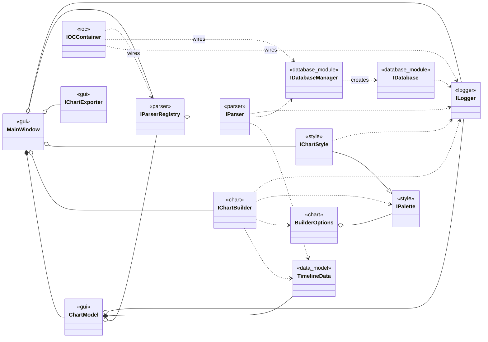
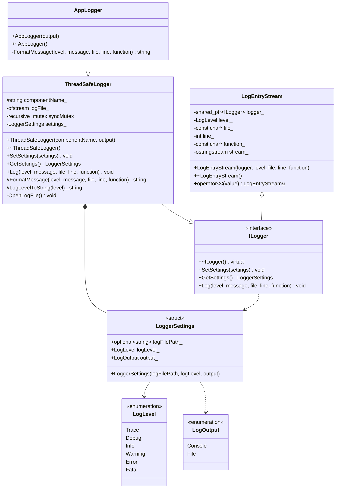
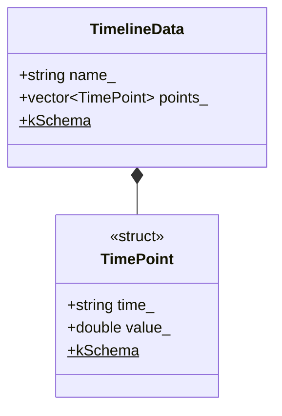
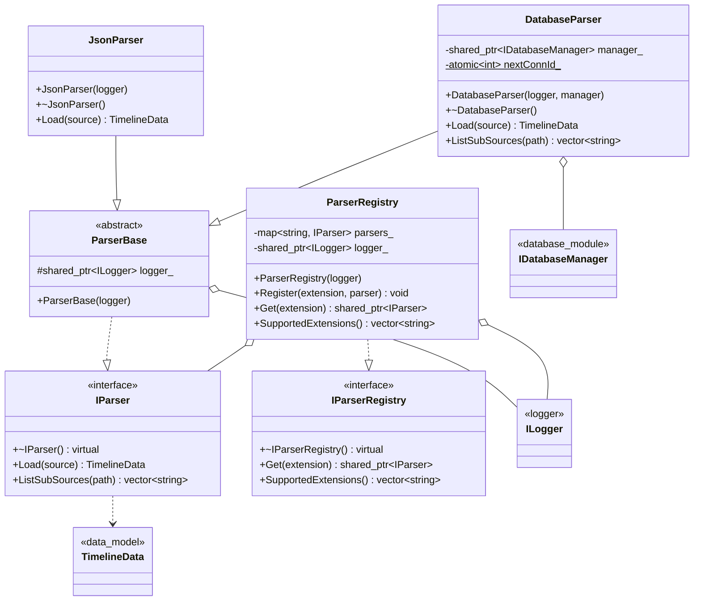
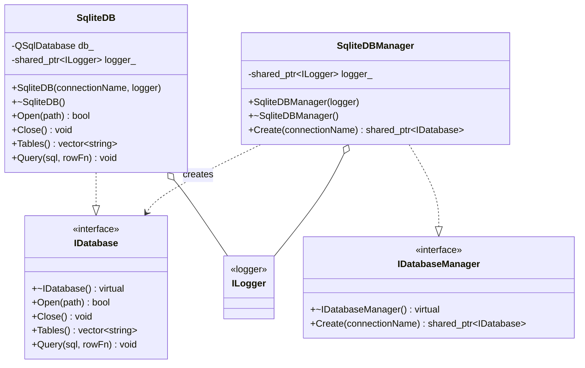
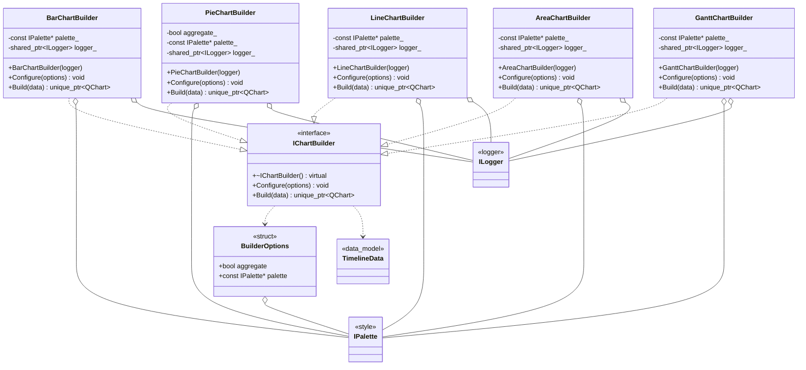
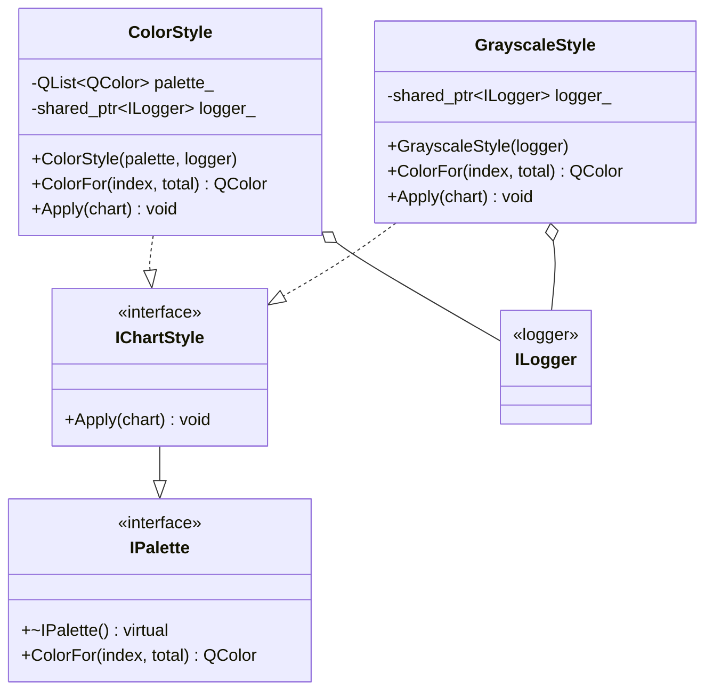
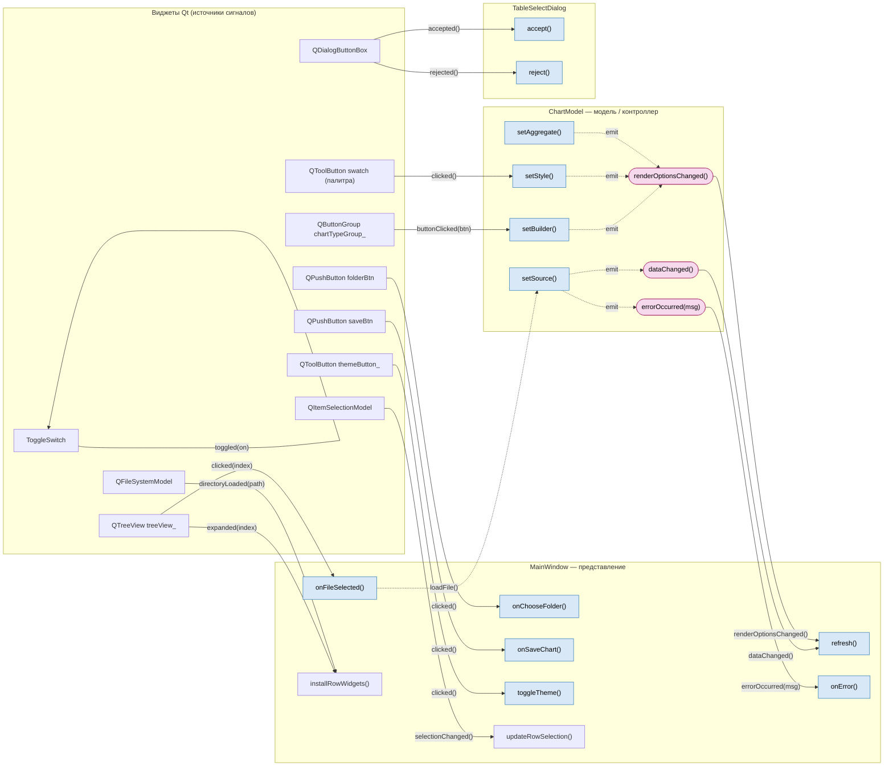

# Лабораторная работа по предмету: "Разработка средств защиты информации"
## Тема: "QtWidgets - Печать графиков"
> 4 курс 2 семестр \
> Студент группы 932223 - **Артеменко Антон Дмитриевич**

## Постановка задачи

### Вспомогательная часть

В рамках лабораторной работы необходимо рассмотреть реализацию IoC-контейнера и
реализовать задание, рассмотренное на лекциях. Реализация IoC-контейнера в проекте —
[`ioc_container/IOC_Contaner.hpp`](ioc_container/IOC_Contaner.hpp).

### Основная часть

Разработка приложения печати графиков.

**Дано:** предложен начальный вариант архитектуры ПО, в которую требуется внести изменения
с целью снижения связности архитектуры. Используется принцип внедрения зависимости.
Реализация внедрения зависимости — с помощью IoC-контейнера.

**При разработке архитектуры учесть:**

- Возможность добавления новых графиков (графики отличаются видом и данными).
- Изменение визуального стиля графиков (цветной, чёрно-белый).

**Общие требования к GUI:**

- Загружаем данные путём выбора нужного файла. Данные в ПО не отображаем — отображаем
  только график, построенный относительно считанных данных.
- При печати в PDF выбираем место сохранения графика.

### Часть №1. Формат исходных данных. Варианты представления входных данных

Исходные данные для печати соответствуют некоторому типу, который определяется
пользователем. Данные определённого типа могут отображаться конкретным графиком,
ориентированным на этот тип данных.

**Примеры данных:**

1. Данные характеризуются парой `[дата, значение]`, хранятся в БД SQLite (архив с данными
   прилагается). Информация по организации работы с БД SQLite:
   <https://habr.com/ru/post/128836/>
2. Данные представлены JSON-файлом (примеры сгенерировать самостоятельно). Формат данных
   `[дата, значение]`. Информация для знакомства и взаимодействия с JSON:
   - <https://habr.com/ru/articles/554274/>
   - <https://doc.qt.io/qt-5/json.html>
   - <https://tproger.ru/articles/chto-takoe-json-vvedenie/>

## Предлагаемое решение

### Зависимости проекта

В проекте используется:

- **CMake** ≥ 3.16
- **Стандарт C++** 17
- **Qt 5** — компоненты `Widgets`, `Charts`, `PrintSupport`, `Core`, `Sql`

`AUTOMOC`/`AUTOUIC` включены — отдельный запуск `moc`/`uic` не требуется.

### Сборка (CMake)

```bash
mkdir -p build && cd buid

cmake .. && cmake --build .

./programming_tech_lab_3
```

## Документация (UML)

Диаграмма классов разбита по модулям — так стрелки не пересекаются и каждый блок
читается отдельно. Исходники — в [`docs/pics`](docs/pics). Внутри модульных диаграмм
коллабораторы из других модулей показаны заглушками со стереотипом-источником
(например, `<<logger>>`) — без членов.

### Обзор (связи между модулями)

Ключевые сущности каждого модуля без членов и связи между ними.
Исходник: [`docs/pics/class_overview.mmd`](docs/pics/class_overview.mmd)



### Модуль logger

Исходник: [`docs/pics/class_logger.mmd`](docs/pics/class_logger.mmd)



### Модуль data_model

Исходник: [`docs/pics/class_data_model.mmd`](docs/pics/class_data_model.mmd)



### Модуль parser

Исходник: [`docs/pics/class_parser.mmd`](docs/pics/class_parser.mmd)



### Модуль database_module

Исходник: [`docs/pics/class_database.mmd`](docs/pics/class_database.mmd)



### Модуль chart

Исходник: [`docs/pics/class_chart.mmd`](docs/pics/class_chart.mmd)



### Модуль style

Исходник: [`docs/pics/class_style.mmd`](docs/pics/class_style.mmd)



### Модуль gui

Исходник: [`docs/pics/class_gui.mmd`](docs/pics/class_gui.mmd)


## Диаграмма сигналов и слотов

Взаимодействие виджетов, модели и представления через механизм сигналов/слотов Qt
(паттерн Model/View). Исходник: [`docs/pics/signal_slot.mmd`](docs/pics/signal_slot.mmd).

- Сплошная стрелка с меткой — `connect(сигнал → слот)`.
- Пунктир `emit` — слот модели эмитит сигнал.
- Пунктир `loadFile()` — прямой вызов (не через `connect`).



### Таблица соединений

| Источник (сигнал)                              | Приёмник (слот)               | Где                      |
|------------------------------------------------|-------------------------------|--------------------------|
| `treeView_::clicked(index)`                    | `MainWindow::onFileSelected`  | `mainwindow.cpp`         |
| `folderBtn::clicked()`                         | `MainWindow::onChooseFolder`  | `mainwindow.cpp`         |
| `saveBtn::clicked()`                           | `MainWindow::onSaveChart`     | `mainwindow.cpp`         |
| `themeButton_::clicked()`                      | `MainWindow::toggleTheme`     | `mainwindow.cpp`         |
| `treeView_::expanded(index)`                   | λ → `installRowWidgets`       | `mainwindow.cpp`         |
| `QFileSystemModel::directoryLoaded(path)`      | λ → `installRowWidgets`       | `mainwindow.cpp` (setRoot) |
| `QItemSelectionModel::selectionChanged()`      | λ → `updateRowSelection`      | `mainwindow.cpp` (setRoot) |
| `chartTypeGroup_::buttonClicked(btn)`          | λ → `ChartModel::setBuilder`  | `mainwindow.cpp`         |
| `swatch::clicked()`                            | λ → `ChartModel::setStyle`    | `mainwindow.cpp` (палитра) |
| `ChartModel::dataChanged()`                    | `MainWindow::refresh`         | `mainwindow.cpp`         |
| `ChartModel::renderOptionsChanged()`           | `MainWindow::refresh`         | `mainwindow.cpp`         |
| `ChartModel::errorOccurred(msg)`               | `MainWindow::onError`         | `mainwindow.cpp`         |
| `QDialogButtonBox::accepted()`                 | `QDialog::accept`             | `table_select_dialog.cpp`|
| `QDialogButtonBox::rejected()`                 | `QDialog::reject`             | `table_select_dialog.cpp`|
| `ToggleSwitch::toggled(on)`                    | λ (анимация ползунка)         | `toggle_switch.cpp`      |

Сигналы `ChartModel` эмитятся из слотов-мутаторов: `setSource` → `dataChanged` / `errorOccurred`;
`setBuilder` / `setStyle` / `setAggregate` → `renderOptionsChanged`.

> Примечание: слот `ChartModel::setAggregate` определён, но в текущей сборке к нему не
> подключён ни один виджет; `setSource` вызывается напрямую из `loadFile()`, а не через `connect`.

## Тестирование

### Пользовательские тест-кейсы

Тестовые данные лежат в [`test_data`](test_data) (JSON-ряды) и
[`test_data/InputData`](test_data/InputData) (БД SQLite)

#### Case №1
Проверка запуска приложения и первичного выбора папки
* Входные параметры: каталог `test_data` с файлами `.json` и `.sqlite`
    * Шаг 1 — выполнить запуск `./programming_tech_lab_3`
    * Шаг 2 — в открывшемся диалоге первичного выбора папки указать каталог `test_data`
* Результат: сначала появляется диалог выбора папки; после подтверждения открывается главное окно с двумя областями — деревом файлов слева и пустой областью графика справа; приложение не завершается

#### Case №2
Проверка отображения всех файлов и иконок
* Входные параметры: каталог с файлами разных типов (`.json`, `.sqlite` и, например, `.txt`)
    * Шаг 1 — нажать кнопку выбора папки и указать этот каталог
* Результат: в дереве видны **все** файлы и папки; json/sqlite показаны со своими иконками формата, остальные файлы — с обобщённой иконкой

#### Case №2.1
Проверка реакции на выбор неподдерживаемого файла
* Входные параметры: в дереве присутствует файл неподдерживаемого формата (например, `.txt`)
    * Шаг 1 — выбрать такой файл в дереве
* Результат: график не строится и сообщение об ошибке не появляется; ранее построенный график сохраняется (рисуются только json и sqlite)

#### Case №3
Проверка построения графика из JSON
* Входные параметры: файл `test_data/MONTHLY_TEMPERATURE.json`
    * Шаг 1 — выбрать в дереве `MONTHLY_TEMPERATURE.json`
* Результат: строится график; над областью отображается имя ряда, в статус-баре — число точек

#### Case №4
Проверка выбора БД с несколькими таблицами
* Входные параметры: файл `test_data/InputData/WEATHER_STATION.sqlite` (содержит 3 таблицы)
    * Шаг 1 — выбрать в дереве `WEATHER_STATION.sqlite`
    * Шаг 2 — в появившемся диалоге выбрать таблицу из списка
* Результат: открывается диалог выбора таблицы со списком из 3 таблиц; после выбора строится график по выбранной таблице

#### Case №5
Проверка выбора БД с одной таблицей
* Входные параметры: файл `test_data/InputData/BLOOD_SUGAR.sqlite` (одна таблица)
    * Шаг 1 — выбрать в дереве `BLOOD_SUGAR.sqlite`
* Результат: диалог выбора таблицы не появляется, график строится сразу по единственной таблице

#### Case №6
Проверка смены типа графика
* Входные параметры: график уже построен (например, из Case №3)
    * Шаг 1 — переключить тип графика в сегмент-контроле (Bar / Pie / Line / Area / Gantt)
* Результат: график перестраивается под выбранный тип из тех же данных, файл повторно не загружается

#### Case №7
Проверка смены палитры / стиля
* Входные параметры: график уже построен
    * Шаг 1 — открыть поповер палитр и выбрать другую палитру
    * Шаг 2 — выбрать стиль «Оттенки серого»
* Результат: график перекрашивается согласно выбранной палитре; в режиме «Оттенки серого» — градации серого

#### Case №8
Проверка переключения темы
* Входные параметры: график уже построен
    * Шаг 1 — нажать кнопку переключения темы
* Результат: интерфейс и область графика переключаются между светлой и тёмной темой

#### Case №9
Проверка экспорта графика в PDF
* Входные параметры: график построен
    * Шаг 1 — выполнить сохранение графика
    * Шаг 2 — в диалоге выбрать место сохранения и подтвердить
* Результат: по указанному пути создаётся PDF-файл с текущим графиком

#### Case №10
Проверка обработки JSON с синтаксической ошибкой
* Входные параметры: файл `test_data/invalid/broken_syntax.json` (нарушен синтаксис JSON)
    * Шаг 1 — выбрать файл в дереве
* Результат: приложение не завершается; выводится сообщение об ошибке загрузки, ранее построенный график сохраняется

#### Case №11
Проверка обработки JSON с неверной схемой
* Входные параметры: файл `test_data/invalid/wrong_schema.json` (валидный JSON, но без полей `name`/`points`)
    * Шаг 1 — выбрать файл в дереве
* Результат: выводится сообщение об ошибке загрузки; приложение продолжает работу

#### Case №12
Проверка обработки JSON с нечисловым значением
* Входные параметры: файл `test_data/invalid/bad_value.json` (поле `Value` содержит строку вместо числа)
    * Шаг 1 — выбрать файл в дереве
* Результат: выводится сообщение об ошибке загрузки; приложение продолжает работу

#### Case №13
Проверка обработки пустого файла
* Входные параметры: файл `test_data/invalid/empty.json` (нулевой размер)
    * Шаг 1 — выбрать файл в дереве
* Результат: выводится сообщение об ошибке загрузки; приложение не завершается

#### Case №14
Проверка обработки файла, не являющегося базой SQLite
* Входные параметры: файл `test_data/invalid/not_a_database.sqlite` (текст с расширением `.sqlite`)
    * Шаг 1 — выбрать файл в дереве
* Результат: выводится сообщение об ошибке открытия базы; приложение продолжает работу